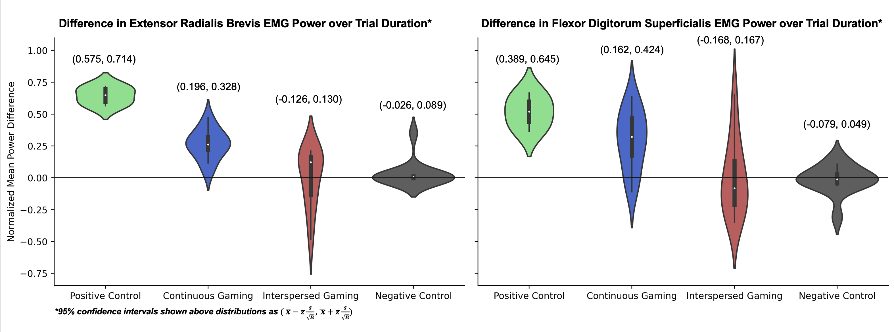

# Indicators for Repetitive Strain Injury derived from EMG

## Overview
This repo provides examples of how to query EMG data using an Arduino and compute spectral statistics relevant to quantifying strain injury risk for console gaming.

## Project Description

<p align="center">
    
</p>

Ever noticed that playing too much video games can sometimes put a strain on your forearms? We aimed to study if this was truly a cause for worry by looking at the muscle activity of the forearms when playing a console video game, in comparison to healthy vs. non-healthy standards for muslce activity.

<p align="center">
    
</p>

The tool we use to proxy "muscle health" is an electromyogram (EMG), which measures the voltage across a muscle during a contraction. When playing a console game, the activity of the forearm muscles can be clearly seen as higher activity of high-frequency components in the EMG. Observe this in the EMG plot below, which shows an EMG collected during intervalic periods alternating console gaming and rest:



We show that taking 5 minute breaks every 10 minutes while gaming significantly decreases the risk for strain-derived injuries from console gaming. The below figure shows the magnitude of high-frequency EMG power when at risk for strain (green), when at rest (black), when continuously engaging in console gaming (blue), and when engaging in console gaming with periodic rests (red). RSI risk is directly correlated to the y axis magnitude.    

Download our poster here: <a id="raw-url" href="https://raw.githubusercontent.com/zachary-shah/zachary-shah.github.io/master/assets/writing/ConsoleGamingEMGforRSI.pdf
">(Download)</a>

## Authors 

This work was completed in collaboration with Samuel Gallemore, Andrew Chyong, and Nikhil Deshmukh as the class project for BMED 3110: Quantitative Physiology Lab I in Spring 2021.

## Contents

Here is some of our sourse code used in signal aquisition and computation of these results. 

### _Arduino
This contains Arduino firmware for single-sensor and multiple-sensor data aquisition of an EMG.

### _data
Contains examples of of Raw EMG and EMG Frequencies collected during study.

### Scripts

```collectEmgData.m```: Example interface for collecting an EMG signal from aquisition circuit thorugh USB port

```analyzeEmgData.m```: Computes EMG spectral statistics given a raw EMG.

```emgAnalysis.m```: Generates summative figures of EMG spectral statistics across study for various gaming experimental setups. (_Note: Data used for this script not made public._)

```VioPlots.ipynb```: Computes the graphic shown above.

```EMG_Strain_Indicator_Example.ipynb```: Demonstration of strain evident through the EMG high-frequency mean power.